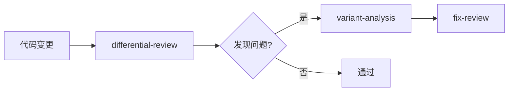
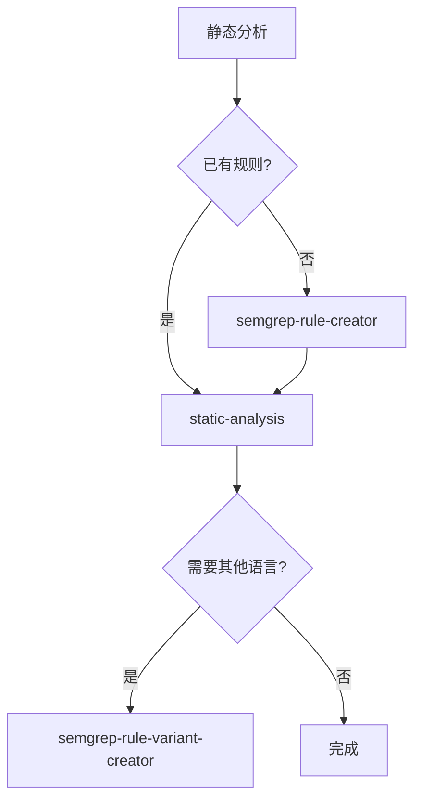
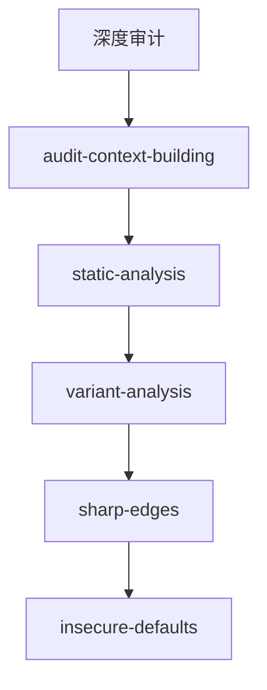
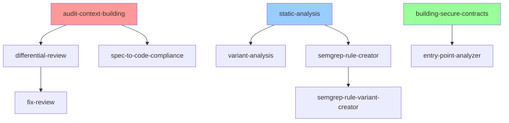
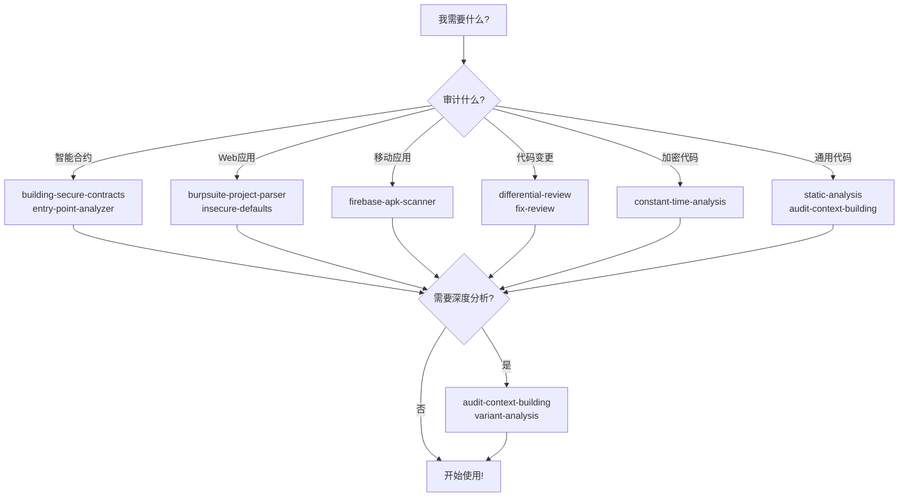

# Trail of Bits Skills 分类速查表

> 快速查找适合您需求的技能

## 📊 按应用领域分类

### 🔐 区块链与智能合约安全

| 技能 | 支持平台 | 主要功能 | 使用难度 |
|------|---------|---------|---------|
| **building-secure-contracts** | Algorand, Cairo, Cosmos, Solana, Substrate, TON, Solidity | 11个专业技能：6个漏洞扫描器+5个开发指南 | ⭐⭐ |
| **entry-point-analyzer** | Solidity, Vyper, Solana, Move, TON, CosmWasm | 分析合约攻击面和权限 | ⭐ |
| **spec-to-code-compliance** | 通用 | 验证代码与规范一致性 | ⭐⭐⭐ |
| **property-based-testing** | Solidity, Vyper + 其他 | 智能合约属性测试 | ⭐⭐ |

---

### 🔍 代码审计与安全分析

| 技能 | 适用场景 | 主要功能 | 使用难度 |
|------|---------|---------|---------|
| **audit-context-building** | 深度代码分析 | 逐行构建代码理解 | ⭐⭐⭐ |
| **differential-review** | PR/代码变更审查 | 安全差异分析+影响面评估 | ⭐⭐⭐ |
| **fix-review** | 审计修复验证 | 验证修复是否解决问题 | ⭐⭐ |
| **insecure-defaults** | 配置审计 | 检测硬编码密钥、弱加密 | ⭐⭐ |
| **sharp-edges** | API设计审查 | 识别危险API和误用风险 | ⭐⭐ |
| **variant-analysis** | 漏洞挖掘 | 查找类似漏洞模式 | ⭐⭐⭐ |

---

### 🛠️ 静态分析工具

| 技能 | 工具 | 主要功能 | 使用难度 |
|------|-----|---------|---------|
| **static-analysis** | CodeQL, Semgrep, SARIF | 综合静态分析工具包 | ⭐⭐ |
| **semgrep-rule-creator** | Semgrep | 创建自定义Semgrep规则 | ⭐⭐ |
| **semgrep-rule-variant-creator** | Semgrep | 将规则移植到新语言 | ⭐⭐ |
| **testing-handbook-skills** | 多种 | 从测试手册生成技能 | ⭐⭐⭐ |

---

### 🔒 加密与时序安全

| 技能 | 检测目标 | 支持语言 | 使用难度 |
|------|---------|---------|---------|
| **constant-time-analysis** | 时序侧信道漏洞 | C, C++, Go, Rust, PHP, JS, TS, Python, Ruby | ⭐⭐ |

**支持架构**: x86_64, ARM64, ARM, RISC-V, PowerPC, s390x, i386

---

### 📱 移动应用安全

| 技能 | 平台 | 主要功能 | 使用难度 |
|------|-----|---------|---------|
| **firebase-apk-scanner** | Android | 扫描Firebase安全配置错误 | ⭐⭐ |

---

### 🌐 Web 应用安全

| 技能 | 工具集成 | 主要功能 | 使用难度 |
|------|---------|---------|---------|
| **burpsuite-project-parser** | Burp Suite | 解析和分析Burp项目文件 | ⭐⭐ |

**前置要求**: Burp Suite Professional + burpsuite-project-file-parser 扩展

---

### 🔧 开发工具

| 技能 | 用途 | 主要功能 | 使用难度 |
|------|-----|---------|---------|
| **ask-questions-if-underspecified** | 需求澄清 | 避免理解错误的需求 | ⭐ |
| **modern-python** | Python开发 | 现代Python工具链(uv, ruff, ty) | ⭐⭐ |
| **property-based-testing** | 测试 | 多语言属性测试指导 | ⭐⭐ |

---

### 🛠️ 逆向工程

| 技能 | 专业领域 | 主要功能 | 使用难度 |
|------|---------|---------|---------|
| **dwarf-expert** | DWARF调试格式 | 解析和理解DWARF数据 | ⭐⭐⭐ |

---

### 👥 团队与管理

| 技能 | 用途 | 主要功能 | 使用难度 |
|------|-----|---------|---------|
| **culture-index** | 团队分析 | 解读文化指数档案，检测倦怠 | ⭐⭐ |

---

### 🆘 故障排除

| 技能 | 解决问题 | 使用难度 |
|------|---------|---------|
| **claude-in-chrome-troubleshooting** | Chrome扩展连接问题 | ⭐ |

---

## 🎯 按使用场景选择

### 场景 1: 我要审计智能合约

**推荐技能组合**:


1. **entry-point-analyzer** - 识别攻击面
2. **audit-context-building** - 建立深度理解
3. **building-secure-contracts** - 扫描特定平台漏洞
   - Solidity → `/secure-workflow-guide`
   - Solana → `/solana-vulnerability-scanner`
   - Cairo → `/cairo-vulnerability-scanner`
4. **spec-to-code-compliance** - 验证规范一致性

---

### 场景 2: 我要审查代码变更（PR审查）

**推荐技能组合**:



1. **differential-review** - 安全差异分析
2. **variant-analysis** - 查找类似问题（如果发现漏洞）
3. **fix-review** - 验证修复（修复后）

---

### 场景 3: 我要进行静态分析

**推荐技能组合**:



1. **static-analysis** - 运行CodeQL/Semgrep
2. **semgrep-rule-creator** - 创建自定义规则（如需要）
3. **semgrep-rule-variant-creator** - 移植规则到其他语言（如需要）

---

### 场景 4: 我要检测加密代码漏洞

**推荐技能组合**:


1. **constant-time-analysis** - 检测时序侧信道
2. **sharp-edges** - 检查API设计问题
3. **differential-review** - 审查密码学相关变更

---

### 场景 5: 我要审计移动应用

**Android + Firebase**:


1. **firebase-apk-scanner** - 扫描Firebase配置
2. **insecure-defaults** - 检查硬编码密钥

---

### 场景 6: 我要审计Web应用

**推荐技能组合**:


1. **burpsuite-project-parser** - 分析Burp流量数据
2. **insecure-defaults** - 检查配置安全
3. **sharp-edges** - 检查API安全

---

### 场景 7: 我要进行深度代码审计

**推荐技能组合**:



1. **audit-context-building** - 建立深度代码理解
2. **static-analysis** - 运行静态分析
3. **variant-analysis** - 查找漏洞变体
4. **sharp-edges** - 检查危险API
5. **insecure-defaults** - 检查配置安全

---

## 📈 按技术栈选择

### Solidity / EVM 智能合约

| 优先级 | 技能 | 用途 |
|-------|------|------|
| ⭐⭐⭐ | building-secure-contracts | 综合扫描+开发指南 |
| ⭐⭐⭐ | entry-point-analyzer | 攻击面分析 |
| ⭐⭐ | audit-context-building | 深度理解 |
| ⭐⭐ | property-based-testing | Echidna测试 |

### Solana / Anchor

| 优先级 | 技能 | 用途 |
|-------|------|------|
| ⭐⭐⭐ | building-secure-contracts | `/solana-vulnerability-scanner` |
| ⭐⭐⭐ | entry-point-analyzer | 入口点分析 |
| ⭐⭐ | audit-context-building | 深度理解 |

### Python 项目

| 优先级 | 技能 | 用途 |
|-------|------|------|
| ⭐⭐⭐ | modern-python | 现代工具链 |
| ⭐⭐⭐ | static-analysis | CodeQL/Semgrep |
| ⭐⭐ | property-based-testing | Hypothesis测试 |
| ⭐⭐ | constant-time-analysis | 加密代码（如适用） |

### JavaScript / TypeScript

| 优先级 | 技能 | 用途 |
|-------|------|------|
| ⭐⭐⭐ | static-analysis | Semgrep扫描 |
| ⭐⭐ | property-based-testing | fast-check测试 |
| ⭐⭐ | insecure-defaults | 配置安全 |
| ⭐ | constant-time-analysis | 加密代码（如适用） |

### Go

| 优先级 | 技能 | 用途 |
|-------|------|------|
| ⭐⭐⭐ | static-analysis | CodeQL/Semgrep |
| ⭐⭐ | constant-time-analysis | 加密代码 |
| ⭐⭐ | insecure-defaults | 配置安全 |

### Rust

| 优先级 | 技能 | 用途 |
|-------|------|------|
| ⭐⭐⭐ | static-analysis | CodeQL/Semgrep |
| ⭐⭐⭐ | constant-time-analysis | 加密代码 |
| ⭐⭐ | property-based-testing | proptest |

### C / C++

| 优先级 | 技能 | 用途 |
|-------|------|------|
| ⭐⭐⭐ | constant-time-analysis | 时序侧信道 |
| ⭐⭐⭐ | static-analysis | CodeQL分析 |
| ⭐⭐ | dwarf-expert | 调试信息分析 |

---

## 🎓 按经验水平选择

### 初学者（刚开始使用）

**推荐顺序**:

1. ⭐ **ask-questions-if-underspecified** - 学习如何澄清需求
2. ⭐ **entry-point-analyzer** - 简单直观的攻击面分析
3. ⭐ **insecure-defaults** - 容易理解的配置问题
4. ⭐ **modern-python** - 现代开发工具（如果用Python）

**学习建议**: 从简单的扫描类技能开始，先看结果，再理解原理。

---

### 中级（有一定经验）

**推荐顺序**:

1. ⭐⭐ **static-analysis** - 掌握CodeQL和Semgrep
2. ⭐⭐ **differential-review** - 学习安全代码审查
3. ⭐⭐ **semgrep-rule-creator** - 创建自定义检测规则
4. ⭐⭐ **building-secure-contracts** - 智能合约专业审计
5. ⭐⭐ **property-based-testing** - 高级测试技术

**学习建议**: 开始组合使用多个技能，理解工作流程。

---

### 高级（专业安全研究员）

**推荐顺序**:

1. ⭐⭐⭐ **audit-context-building** - 深度代码分析方法论
2. ⭐⭐⭐ **variant-analysis** - 高级漏洞挖掘
3. ⭐⭐⭐ **constant-time-analysis** - 时序侧信道专家级检测
4. ⭐⭐⭐ **spec-to-code-compliance** - 规范一致性验证
5. ⭐⭐⭐ **dwarf-expert** - 底层逆向分析

**学习建议**: 深入理解每个技能的方法论，定制化工作流程。

---

## 🔗 技能依赖关系



**图例**:
- 🔴 红色：深度分析技能
- 🔵 蓝色：静态分析技能
- 🟢 绿色：智能合约技能

---

## 💰 按投资回报率（ROI）选择

### 高 ROI（快速见效）

| 技能 | 原因 | 建议优先级 |
|------|-----|-----------|
| insecure-defaults | 快速发现硬编码密钥 | 🔥🔥🔥 |
| entry-point-analyzer | 快速了解攻击面 | 🔥🔥🔥 |
| static-analysis | 自动化扫描，快速发现问题 | 🔥🔥🔥 |
| firebase-apk-scanner | Android应用快速扫描 | 🔥🔥 |

### 中 ROI（需要时间学习）

| 技能 | 原因 | 建议优先级 |
|------|-----|-----------|
| differential-review | 需要理解Git历史和代码上下文 | 🔥🔥 |
| semgrep-rule-creator | 需要学习Semgrep规则语法 | 🔥🔥 |
| building-secure-contracts | 需要区块链知识 | 🔥🔥 |
| constant-time-analysis | 需要理解汇编和时序 | 🔥🔥 |

### 长期 ROI（深度投资）

| 技能 | 原因 | 建议优先级 |
|------|-----|-----------|
| audit-context-building | 方法论学习，长期受益 | 🔥 |
| variant-analysis | 需要深度理解漏洞模式 | 🔥 |
| dwarf-expert | 专业领域，应用范围窄 | 🔥 |

---

## 📦 预设技能包

### 智能合约审计包

```bash
/plugin install trailofbits/skills/plugins/building-secure-contracts
/plugin install trailofbits/skills/plugins/entry-point-analyzer
/plugin install trailofbits/skills/plugins/audit-context-building
/plugin install trailofbits/skills/plugins/spec-to-code-compliance
```

### Web安全审计包

```bash
/plugin install trailofbits/skills/plugins/burpsuite-project-parser
/plugin install trailofbits/skills/plugins/insecure-defaults
/plugin install trailofbits/skills/plugins/sharp-edges
/plugin install trailofbits/skills/plugins/static-analysis
```

### 代码审查包

```bash
/plugin install trailofbits/skills/plugins/differential-review
/plugin install trailofbits/skills/plugins/fix-review
/plugin install trailofbits/skills/plugins/variant-analysis
/plugin install trailofbits/skills/plugins/insecure-defaults
```

### Python开发包

```bash
/plugin install trailofbits/skills/plugins/modern-python
/plugin install trailofbits/skills/plugins/static-analysis
/plugin install trailofbits/skills/plugins/property-based-testing
```

### 加密安全包

```bash
/plugin install trailofbits/skills/plugins/constant-time-analysis
/plugin install trailofbits/skills/plugins/sharp-edges
/plugin install trailofbits/skills/plugins/differential-review
```

### 移动安全包

```bash
/plugin install trailofbits/skills/plugins/firebase-apk-scanner
/plugin install trailofbits/skills/plugins/insecure-defaults
/plugin install trailofbits/skills/plugins/static-analysis
```

---

## 🔍 按检测能力选择

### 漏洞类型 → 推荐技能

| 漏洞类型 | 推荐技能 | 检测能力 |
|---------|---------|---------|
| **硬编码密钥** | insecure-defaults | ⭐⭐⭐⭐⭐ |
| **SQL注入** | static-analysis (CodeQL/Semgrep) | ⭐⭐⭐⭐⭐ |
| **时序侧信道** | constant-time-analysis | ⭐⭐⭐⭐⭐ |
| **重入攻击** | building-secure-contracts | ⭐⭐⭐⭐⭐ |
| **整数溢出** | building-secure-contracts, static-analysis | ⭐⭐⭐⭐ |
| **访问控制** | sharp-edges, audit-context-building | ⭐⭐⭐⭐ |
| **配置错误** | insecure-defaults, sharp-edges | ⭐⭐⭐⭐ |
| **Firebase错误配置** | firebase-apk-scanner | ⭐⭐⭐⭐⭐ |
| **API设计缺陷** | sharp-edges | ⭐⭐⭐⭐ |
| **代码规范偏差** | spec-to-code-compliance | ⭐⭐⭐⭐ |
| **安全回归** | differential-review, fix-review | ⭐⭐⭐⭐ |

---

## 📝 快速决策流程图



---

## 🎯 总结：如何选择？

### 3个简单问题

1. **我在做什么？**
   - 智能合约 → building-secure-contracts
   - Web应用 → burpsuite-project-parser
   - 移动应用 → firebase-apk-scanner
   - 代码审查 → differential-review
   - 通用审计 → static-analysis

2. **我的经验如何？**
   - 初学者 → 从简单的扫描类技能开始
   - 中级 → 学习静态分析和规则创建
   - 高级 → 深入方法论和变体分析

3. **我有多少时间？**
   - 快速扫描 → insecure-defaults, entry-point-analyzer
   - 中等投入 → differential-review, static-analysis
   - 深度分析 → audit-context-building, variant-analysis

---

**文档版本**: 1.0  
**最后更新**: 2026-01-29  
**维护**: Trail of Bits 社区

