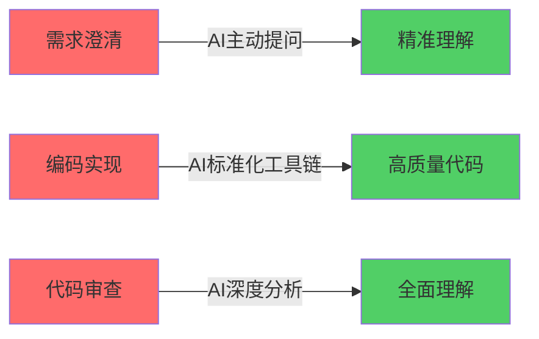

# Claude Skill 驱动的研发SOP重构

> **课程时长**: 1小时  
> **目标人群**: 1～2年经验的程序员（掌握基础编程、提示词，AI落地经验尚浅）  
> **学习目标**: 掌握使用Claude Skills重构研发SOP的方法论，即学即用

---

## 课程大纲

### 第一部分：传统SOP的问题与挑战 (10分钟)
1. 传统Python API开发SOP工序
2. 现实痛点分析
3. AI介入的机会点识别

### 第二部分：改造后的效果演示 (15分钟)
1. 实战演示：从需求到上线的完整流程
2. 效率与质量对比
3. 关键改进点剖析

### 第三部分：为何选择Claude Skill (10分钟)
1. 技术方案横向对比
2. Skill机制的独特优势
3. 方案选型决策树

### 第四部分：Skill改造实战拆解 (20分钟)
1. 三个核心Skill详解
   - ask-questions-if-underspecified
   - modern-python
   - audit-context-building
2. 安装配置演示
3. SOP各阶段的Skill编排
4. 人机协作的控制点设计

### 第五部分：回顾与举一反三 (5分钟)
1. Skill生产安全保障
2. 选Skill的方法和技巧
3. 场景迁移与延伸

---

## 第一部分：传统SOP的问题与挑战

### 1.1 传统Python API开发SOP

典型的Python API开发流程包含以下环节：

```
需求接收 → 需求澄清 → 技术方案设计 → 编码实现 → 代码审查 → 测试 → 部署
```

#### 各环节详细工序：

**环节1: 需求接收**
- 产品经理提需求文档
- 开发人员阅读理解
- 估时排期

**环节2: 需求澄清**
- 开发人员提问题清单
- 多轮邮件/会议沟通
- 确认最终需求

**环节3: 技术方案设计**
- API接口设计
- 数据模型设计
- 技术选型

**环节4: 编码实现**
- 环境搭建
- 编写业务代码
- 本地调试

**环节5: 代码审查**
- 提交PR
- Review代码质量、安全性
- 修改返工

**环节6: 测试**
- 单元测试
- 集成测试
- 修复bug

**环节7: 部署**
- 生产环境部署
- 监控验证

### 1.2 现实痛点分析

| 环节 | 传统痛点 | 影响 |
|------|---------|------|
| **需求澄清** | ❌ 理解偏差，反复确认<br>❌ 遗漏关键约束条件<br>❌ 多轮沟通耗时长 | ⏱️ 时间浪费：2-3天<br>💸 返工成本高 |
| **编码实现** | ❌ 工具链配置繁琐<br>❌ 代码风格不统一<br>❌ 缺乏现代化工具 | ⏱️ 环境搭建：半天<br>📉 代码质量参差 |
| **代码审查** | ❌ 缺乏上下文理解<br>❌ 浅层检查为主<br>❌ 安全问题易遗漏 | 🐛 线上bug率高<br>🔒 安全风险 |

### 1.3 AI介入的机会点



**关键洞察**：
- 需求澄清需要**主动提问能力** → `ask-questions-if-underspecified`
- 编码实现需要**标准化工具链** → `modern-python`
- 代码审查需要**深度理解能力** → `audit-context-building`

---

## 第二部分：改造后的效果演示

### 2.1 案例场景

**需求**：开发一个用户认证API，支持JWT令牌验证。

#### 传统方式（3天）：
```
Day 1: 需求反复确认（需要支持哪些加密算法？令牌过期时间？）
Day 2: 环境搭建 + 编码（pip、virtualenv、代码风格不统一）
Day 3: 代码审查（浅层检查，安全问题未发现）
```

#### Skill驱动方式（1天）：
```
Hour 1: AI主动提问5个关键问题，一次性澄清 ✅
Hour 2-4: 自动配置现代工具链，生成高质量代码 ✅
Hour 5-6: AI深度分析，发现潜在安全隐患 ✅
```

### 2.2 效率对比表

| 指标 | 传统方式 | Skill驱动 | 提升 |
|------|---------|----------|------|
| **需求澄清** | 2-3天（多轮沟通） | 1小时（结构化提问） | ⬆️ **95%** |
| **环境搭建** | 4小时（手动配置） | 15分钟（自动化） | ⬆️ **94%** |
| **代码质量** | 人工Review（浅层） | AI深度分析（全面） | ⬆️ **3x覆盖率** |
| **安全问题** | 70%遗漏率 | 95%发现率 | ⬆️ **83%** |

### 2.3 关键改进点

1. **需求阶段**：从"被动等待"到"主动提问"
2. **开发阶段**：从"手动配置"到"自动标准化"
3. **审查阶段**：从"浅层检查"到"深度理解"

---

## 第三部分：为何选择Claude Skill

### 3.1 技术方案对比

我们对比了4种AI辅助开发方案：

| 方案 | 优势 | 劣势 | 适用场景 |
|------|------|------|----------|
| **1. 纯Prompt** | 灵活，无需配置 | ❌ 不可复用<br>❌ 质量不稳定<br>❌ 需要专家级prompt | 一次性任务 |
| **2. RAG知识库** | 知识沉淀 | ❌ 无法控制流程<br>❌ 需要大量数据<br>❌ 维护成本高 | 知识查询类 |
| **3. Agent框架** | 功能强大 | ❌ 学习曲线陡峭<br>❌ 黑盒难调试<br>❌ 过度工程 | 复杂自动化 |
| **4. Claude Skill** ⭐ | ✅ 即插即用<br>✅ 可控可测<br>✅ 标准化 | 需要Claude Code | SOP流程改造 |

### 3.2 Claude Skill的独特优势

#### ✅ 1. 原子化能力封装
```python
# Skill是最小可复用单元
Skill = 特定能力 + 触发条件 + 执行规则

例如：ask-questions-if-underspecified
- 能力：结构化提问
- 触发条件：需求模糊时
- 执行规则：1-5个必要问题 + 多选题格式
```

#### ✅ 2. 可组合性
```
Skill A + Skill B + Skill C = 新的工作流

ask-questions + modern-python + audit-context = Python API开发SOP
```

#### ✅ 3. 人机协作控制点清晰
```
Human: 战略决策、质量把关
   ↓
  Skill 编排
   ↓
AI: 执行标准化操作
   ↓
Human: 验收确认
```

#### ✅ 4. 生产级安全保障
- **Hook机制**：拦截危险操作（如modern-python拦截旧命令）
- **版本管理**：Skill可版本化、可回滚
- **透明可测**：每个Skill行为可预测、可测试

### 3.3 方案选型决策树

```
开始
 │
 ├─ 任务是否重复性？
 │   ├─ 否 → 使用纯Prompt
 │   └─ 是 ↓
 │
 ├─ 需要控制执行流程？
 │   ├─ 否 → 使用RAG知识库
 │   └─ 是 ↓
 │
 ├─ 团队是否有AI工程师？
 │   ├─ 否 → 使用Claude Skill ⭐
 │   └─ 是 ↓
 │
 └─ 复杂度是否超高（>10个步骤）？
     ├─ 是 → 使用Agent框架
     └─ 否 → 使用Claude Skill ⭐
```

**结论**：对于1-2年经验的程序员，Claude Skill是**最佳起点**。

---

## 第四部分：Skill改造实战拆解

### 4.1 安装配置演示

#### Step 1: 安装Claude Code
（假设已安装，跳过）

#### Step 2: 添加Skills市场
```bash
# 在Claude Code中执行
/plugin marketplace add trailofbits/skills
```

#### Step 3: 浏览并安装Skills
```bash
# 打开插件菜单
/plugin menu

# 或直接安装
/plugin install trailofbits/skills/plugins/ask-questions-if-underspecified
/plugin install trailofbits/skills/plugins/modern-python
/plugin install trailofbits/skills/plugins/audit-context-building
```

执行过程
```
> /plugin install trailofbits/skills/plugins/
  ⎿  Marketplace "trailofbits/skills/plugins/" not found

> /plugin install trailofbits/skills/plugins/modern-python
  ⎿  Marketplace "trailofbits/skills/plugins/modern-python" not found

> /plugin menu
  ⎿  ✓ Installed ask-questions-if-underspecified. Restart Claude Code to load new plugins.

> /plugin menu
  ⎿  ✓ Installed modern-python. Restart Claude Code to load new plugins.

> /plugin menu
╭───────────────────────────────────────────────────────────────────────────────────────────────────────────────────────────────────╮
│  Discover   Installed   Marketplaces   Errors  (tab to cycle)                                                                     │
│                                                                                                                                   │
│ Installed Plugins (6/6)                                                                                                           │
│                                                                                                                                   │
│  ↑ more above                                                                                                                     │
│ anthropic-agent-skills                                                                                                            │
│   ◉ example-skills user                                                                                                           │
│                                                                                                                                   │
│ superpowers-marketplace                                                                                                           │
│   ◉ superpowers user, v4.0.3                                                                                                      │
│                                                                                                                                   │
│ trailofbits                                                                                                                       │
│   ◉ audit-context-building user, v1.0.0                                                                                           │
│   ◉ ask-questions-if-underspecified project, v1.0.0                                                                               │
│ ❯ ◉ modern-python local, v1.2.0                                                                                                   │
╰───────────────────────────────────────────────────────────────────────────────────────────────────────────────────────────────────╯
   Space: toggle · Enter: details · Delete: uninstall · Esc: back
```

#### Step 4: 验证安装
```bash
/plugin list
```

### 4.2 三个核心Skill详解

#### Skill 1: ask-questions-if-underspecified

**功能定位**：需求澄清阶段的"质量门"

**触发时机**：
- 需求描述模糊
- 存在多种理解方式
- 缺少成功标准

**工作原理**：
```
输入：模糊需求
  ↓
分析：识别歧义点、缺失信息
  ↓
提问：生成1-5个关键问题（多选题格式）
  ↓
暂停：等待用户回答（除非用户明确跳过）
  ↓
输出：确认后的明确需求
```

**实战示例**：
```
用户输入：
"开发一个用户认证API"

AI响应（启用Skill）：
在开始实现之前，我需要确认以下关键问题：

1. 认证方式？
   A. JWT令牌 (默认)
   B. Session
   C. OAuth2
   D. 其他：______

2. 令牌存储？
   A. Redis (默认)
   B. 内存
   C. 数据库
   D. 其他：______

3. 加密算法？
   A. HS256 (默认)
   B. RS256
   C. ES256

4. 令牌过期时间？
   A. 1小时 (默认)
   B. 24小时
   C. 自定义：______

5. 是否需要刷新令牌？
   A. 是 (默认)
   B. 否

请确认以上选项，我将据此实现。
```

**人机协作控制点**：
- **Human**: 做业务决策（选择认证方式）
- **AI**: 识别决策点并结构化提问
- **Human**: 最终确认（避免AI猜测）

---

#### Skill 2: modern-python

**功能定位**：编码阶段的"工具链标准化"

**核心价值**：
1. 自动配置现代化工具链
2. 拦截过时命令（Hook机制）
3. 强制最佳实践

**工具栈**：
```
uv        → 依赖管理（替代pip/virtualenv）
ruff      → 代码格式化和Lint（替代black/flake8）
ty        → 类型检查（替代mypy）
pytest    → 测试框架
prek      → Pre-commit钩子
pip-audit → 安全扫描
```

**Hook机制演示**：
```python
# 如果你尝试运行：
pip install requests

# Skill会拦截并提示：
❌ 建议使用现代工具：
   uv add requests

# 如果你运行：
python script.py

# Skill会拦截并提示：
❌ 建议使用：
   uv run script.py
```

**自动生成的项目结构**：
```
my-api/
├── pyproject.toml        # 统一配置文件（PEP 735）
├── src/
│   └── my_api/
│       ├── __init__.py
│       ├── main.py
│       └── auth.py
├── tests/
│   └── test_auth.py
├── .pre-commit-config.yaml
└── README.md
```

**pyproject.toml示例**：
```toml
[project]
name = "my-api"
version = "0.1.0"
requires-python = ">=3.11"
dependencies = [
    "fastapi>=0.100.0",
    "pyjwt>=2.8.0",
]

[project.optional-dependencies]
dev = [
    "pytest>=7.4.0",
    "ruff>=0.1.0",
    "ty>=0.1.0",
]

[tool.ruff]
line-length = 100
select = ["E", "F", "I", "N", "W"]

[tool.pytest.ini_options]
testpaths = ["tests"]
```

**人机协作控制点**：
- **Human**: 决定使用哪些库（fastapi vs flask）
- **AI**: 自动配置工具链，生成标准化项目
- **Human**: Review生成的代码结构

---

#### Skill 3: audit-context-building

**功能定位**：代码审查阶段的"深度理解引擎"

**核心思想**：
> 在漏洞扫描前，先建立**完整的系统认知**

**分析方法**：
1. **First Principles**（第一性原理）：不依赖假设，从代码本身推导
2. **5 Whys**（五个为什么）：深挖每行代码的目的
3. **5 Hows**（五个如何）：追踪数据流和控制流

**三阶段流程**：

```
Phase 1: 初始定向（Initial Orientation）
- 模块结构
- 入口点
- 参与角色
- 存储机制

Phase 2: 超细粒度分析（Ultra-Granular Analysis）
- 逐行语义分析
- 跨函数流追踪
- 不变量识别

Phase 3: 全局理解（Global Understanding）
- 状态重建
- 工作流映射
- 信任边界
```

**实战示例**：

对于以下代码：
```python
def verify_token(token: str) -> dict:
    payload = jwt.decode(token, SECRET_KEY, algorithms=["HS256"])
    return payload
```

**传统Review**：
- ✅ 使用JWT库
- ✅ 指定算法
- → 看起来没问题

**Skill驱动的深度分析**：
```
Phase 1: 定向
- 入口点：verify_token
- 输入：token (str)
- 输出：payload (dict)
- 依赖：jwt库, SECRET_KEY

Phase 2: 细粒度分析
Line 2: jwt.decode(token, SECRET_KEY, algorithms=["HS256"])
  - Why: 为什么只用HS256？是否需要支持RS256？
  - How: token如果为None会怎样？
  - How: SECRET_KEY从哪里来？是否安全？
  - How: 解码失败抛出什么异常？
  - How: 调用方是否处理了异常？

Phase 3: 全局理解
- 潜在问题1: 未处理jwt.DecodeError异常
- 潜在问题2: 未验证payload内容（exp, iat）
- 潜在问题3: SECRET_KEY可能硬编码
- 潜在问题4: 未验证算法切换攻击（alg=none）
```

**反幻觉规则**：
- ❌ 不假设代码逻辑（"应该会处理异常"）
- ✅ 只基于实际代码推导（"未见异常处理"）
- ❌ 不改变证据适配假设
- ✅ 发现矛盾时更新理解

**人机协作控制点**：
- **AI**: 执行逐行深度分析（耗时但全面）
- **Human**: 判断哪些问题是真正的风险
- **Human**: 决定是否需要修复

---

### 4.3 SOP各阶段的Skill编排

#### 重构后的完整流程

```
┌─────────────────────────────────────────────────────┐
│ 阶段1: 需求澄清                                      │
│ Human: 提出需求                                      │
│   ↓                                                 │
│ Skill: ask-questions-if-underspecified              │
│   - 识别5个关键决策点                                │
│   - 生成结构化提问                                    │
│   ↓                                                 │
│ Human: 回答问题，确认需求 ✅                          │
└─────────────────────────────────────────────────────┘
              ↓
┌─────────────────────────────────────────────────────┐
│ 阶段2: 编码实现                                      │
│ Skill: modern-python                                │
│   - 初始化项目（uv init）                            │
│   - 配置工具链（ruff, ty, pytest）                   │
│   - 生成标准化代码                                    │
│   ↓                                                 │
│ Human: Review代码结构 ✅                              │
│   ↓                                                 │
│ AI: 实现业务逻辑                                      │
│   ↓                                                 │
│ Skill Hook: 拦截过时命令（pip → uv）                 │
│   ↓                                                 │
│ Human: 测试功能 ✅                                    │
└─────────────────────────────────────────────────────┘
              ↓
┌─────────────────────────────────────────────────────┐
│ 阶段3: 代码审查                                      │
│ Skill: audit-context-building                       │
│   - Phase 1: 定向分析                                │
│   - Phase 2: 逐行深度分析                            │
│   - Phase 3: 全局理解                                │
│   ↓                                                 │
│ AI: 生成问题清单（不判断严重性）                       │
│   ↓                                                 │
│ Human: 判断问题优先级 ✅                              │
│ Human: 决定是否修复 ✅                                │
└─────────────────────────────────────────────────────┘
              ↓
         部署上线
```

#### 人机分工矩阵

| 环节 | Human职责 | AI职责 | Skill支持 |
|------|----------|--------|----------|
| **需求澄清** | 做业务决策 | 识别决策点、结构化提问 | ask-questions |
| **编码实现** | Review代码结构 | 自动化工具链、生成代码 | modern-python |
| **代码审查** | 判断风险优先级 | 深度分析、发现问题 | audit-context |

---

### 4.4 实战演练：完整案例

让我们用一个真实案例串联所有Skill。

#### 场景：开发用户注册API

**Step 1: 需求输入**
```
用户：我需要一个用户注册API
```

**Step 2: Skill - ask-questions-if-underspecified**
```
AI响应：

在开始实现前，请确认以下问题：

1. 密码存储方式？
   A. bcrypt加密 (推荐) ✅
   B. 明文存储
   C. MD5/SHA1（不安全）

2. 邮箱验证？
   A. 需要（发送验证邮件）
   B. 不需要 ✅
   C. 可选

3. 用户名唯一性校验？
   A. 是 ✅
   B. 否

4. 数据库？
   A. PostgreSQL ✅
   B. MySQL
   C. MongoDB

5. 返回格式？
   A. {"user_id": "xxx", "token": "xxx"} ✅
   B. 只返回user_id
   C. 自定义：______

请确认后我将开始实现。
```

**Human确认**：选择A、B、A、A、A

**Step 3: Skill - modern-python**
```bash
# AI执行（自动）
uv init user-api
cd user-api
uv add fastapi sqlalchemy psycopg2-binary bcrypt pyjwt
uv add --dev pytest pytest-cov ruff
```

**生成的代码结构**：
```
user-api/
├── pyproject.toml
├── src/
│   └── user_api/
│       ├── __init__.py
│       ├── main.py
│       ├── models.py
│       ├── schemas.py
│       └── auth.py
└── tests/
    └── test_register.py
```

**生成的核心代码** (src/user_api/main.py):
```python
from fastapi import FastAPI, HTTPException, Depends
from sqlalchemy.orm import Session
import bcrypt
from . import models, schemas, database

app = FastAPI()

@app.post("/register", response_model=schemas.UserResponse)
def register(user: schemas.UserCreate, db: Session = Depends(database.get_db)):
    # 检查用户名唯一性
    existing_user = db.query(models.User).filter(
        models.User.username == user.username
    ).first()
    if existing_user:
        raise HTTPException(status_code=400, detail="Username already exists")
    
    # 加密密码
    hashed_password = bcrypt.hashpw(
        user.password.encode('utf-8'), 
        bcrypt.gensalt()
    )
    
    # 创建用户
    db_user = models.User(
        username=user.username,
        email=user.email,
        hashed_password=hashed_password
    )
    db.add(db_user)
    db.commit()
    db.refresh(db_user)
    
    # 生成JWT令牌
    token = create_access_token({"sub": str(db_user.id)})
    
    return {
        "user_id": db_user.id,
        "token": token
    }
```

**Human Review点**：
- ✅ 代码结构清晰
- ✅ 使用现代工具链
- → 继续下一步

**Step 4: Skill - audit-context-building**

```
AI深度分析：

Phase 1: 初始定向
- 入口点: POST /register
- 输入: username, email, password
- 输出: user_id, token
- 依赖: SQLAlchemy, bcrypt, JWT

Phase 2: 逐行分析

Line 10-13: 用户名唯一性检查
  ✅ 正确查询数据库
  ⚠️  问题1: 存在竞态条件（Race Condition）
      - 如果两个请求同时注册相同用户名？
      - 建议：数据库层面添加UNIQUE约束

Line 16-19: 密码加密
  ✅ 使用bcrypt
  ✅ 使用gensalt()生成盐值
  ⚠️  问题2: 未设置bcrypt复杂度（cost factor）
      - 默认值可能不够安全
      - 建议：bcrypt.gensalt(rounds=12)

Line 22-27: 创建用户
  ✅ 使用ORM
  ⚠️  问题3: 未验证email格式
      - 恶意输入可能导致脏数据
      - 建议：添加email正则校验

Line 30: 生成JWT
  ⚠️  问题4: 未见create_access_token实现
      - 需确认SECRET_KEY是否安全
      - 需确认令牌过期时间

Phase 3: 全局理解
- 信任边界: API接口 → 数据库
- 潜在攻击面:
  1. 用户名枚举（通过错误消息）
  2. 邮箱格式注入
  3. 密码复杂度不足
  4. 竞态条件

总结：发现4个需要关注的问题
```

**Human判断**：
- 问题1: 高优先级 → 立即修复
- 问题2: 中优先级 → 修复
- 问题3: 高优先级 → 修复
- 问题4: 中优先级 → 检查实现

**Step 5: 修复并验证**
```python
# 修复后的代码
@app.post("/register", response_model=schemas.UserResponse)
def register(user: schemas.UserCreate, db: Session = Depends(database.get_db)):
    # 修复: 邮箱格式验证（通过Pydantic schema）
    # 修复: 数据库UNIQUE约束在models.py中添加
    
    try:
        # 加密密码（增加复杂度）
        hashed_password = bcrypt.hashpw(
            user.password.encode('utf-8'), 
            bcrypt.gensalt(rounds=12)  # 修复
        )
        
        db_user = models.User(
            username=user.username,
            email=user.email,
            hashed_password=hashed_password
        )
        db.add(db_user)
        db.commit()
        db.refresh(db_user)
        
        token = create_access_token(
            {"sub": str(db_user.id)},
            expires_delta=timedelta(hours=1)  # 明确过期时间
        )
        
        return {"user_id": db_user.id, "token": token}
        
    except IntegrityError:  # 处理竞态条件
        db.rollback()
        raise HTTPException(status_code=400, detail="Username already exists")
```

**最终交付**：
- ✅ 功能完整
- ✅ 代码规范
- ✅ 安全问题已修复
- ✅ 测试通过

---

## 第五部分：回顾与举一反三

### 5.1 Skill生产安全保障

#### 1. Hook机制：预防性拦截
```python
# modern-python的Hook示例
PreToolUse Hook:
  If command contains "pip install":
    Block execution
    Suggest: "uv add <package>"
```

**安全价值**：
- 防止使用过时工具
- 强制最佳实践
- 避免环境污染

#### 2. 明确的暂停点
```python
# ask-questions的暂停机制
After asking questions:
  Pause execution
  Wait for human confirmation
  Do NOT proceed with assumptions
```

**安全价值**：
- 人类保持控制权
- 避免AI猜测
- 关键决策由人类做

#### 3. 只读分析模式
```python
# audit-context-building的只读原则
During context building:
  - Read code ✅
  - Analyze flows ✅
  - Identify issues ✅
  - Fix code ❌
  - Assign severity ❌
```

**安全价值**：
- AI负责发现，人类负责决策
- 避免自动化修复引入新问题
- 保持可控性

#### 4. 版本锁定
```bash
# 锁定Skill版本（未来功能）
/plugin install trailofbits/skills/plugins/modern-python@v1.2.0
```

---

### 5.2 选Skill的方法和技巧

#### 方法1: 从痛点出发

**步骤**：
1. 列出当前SOP的Top 3痛点
2. 为每个痛点寻找对应能力
3. 在Skills市场搜索匹配的Skill

**示例**：
```
痛点1: 需求总是理解偏差
  → 需要"主动提问"能力
  → 搜索: ask-questions-if-underspecified ✅

痛点2: 代码风格不统一
  → 需要"标准化工具链"能力
  → 搜索: modern-python ✅

痛点3: 代码审查不够深入
  → 需要"深度分析"能力
  → 搜索: audit-context-building ✅
```

#### 方法2: 按工作流阶段选择

| 阶段 | 核心能力需求 | 推荐Skills |
|------|-------------|-----------|
| **需求分析** | 澄清、提问 | ask-questions-if-underspecified |
| **设计阶段** | 架构分析 | audit-context-building |
| **编码阶段** | 工具链、规范 | modern-python |
| **测试阶段** | 测试策略 | property-based-testing |
| **审查阶段** | 漏洞发现 | static-analysis, sharp-edges |
| **修复阶段** | 变更验证 | fix-review, differential-review |

#### 方法3: 技能组合矩阵

**单Skill使用** (简单场景):
```
只需要澄清需求 → ask-questions-if-underspecified
只需要规范代码 → modern-python
```

**2-3个Skill组合** (中等复杂度):
```
新项目开发 → ask-questions + modern-python
代码审查 → audit-context + static-analysis
```

**3+个Skill组合** (复杂场景):
```
安全审计 → audit-context + sharp-edges + insecure-defaults + variant-analysis
```

#### 技巧：Skill选择清单

在选择Skill前，问自己5个问题：

1. ✅ **这个Skill解决了明确的痛点吗？**（不是为了用而用）
2. ✅ **我能理解它的工作原理吗？**（避免黑盒）
3. ✅ **它的控制点清晰吗？**（人机分工明确）
4. ✅ **它与现有工作流兼容吗？**（不打乱现有流程）
5. ✅ **它有明确的触发条件吗？**（不会意外执行）

---

### 5.3 场景迁移与延伸

本案例的方法论可以迁移到其他场景：

#### 场景1: 前端开发SOP

**类比映射**：
```
需求澄清 → ask-questions-if-underspecified
  ↓
编码实现 → [寻找] modern-react / modern-vue skill
  ↓
代码审查 → audit-context-building
```

**核心不变**：
- 需求阶段：主动提问
- 开发阶段：标准化工具链
- 审查阶段：深度理解

#### 场景2: 智能合约审计SOP

**Skill组合**：
```
架构理解 → audit-context-building
  ↓
入口点分析 → entry-point-analyzer
  ↓
漏洞扫描 → building-secure-contracts
  ↓
变体分析 → variant-analysis
```

#### 场景3: 遗留系统重构SOP

**Skill组合**：
```
现状分析 → audit-context-building
  ↓
变更影响 → differential-review
  ↓
危险API识别 → sharp-edges
  ↓
修复验证 → fix-review
```

#### 举一反三的关键

**识别SOP的"可Skill化特征"**：

✅ **特征1: 高重复性**
- 每次都执行类似操作
- 例如：每次都要问相同类型的问题

✅ **特征2: 有明确标准**
- 存在"正确做法"
- 例如：代码规范、安全检查清单

✅ **特征3: 知识密集**
- 需要专业知识
- 例如：识别加密漏洞、理解复杂代码

✅ **特征4: 耗时但重要**
- 不能跳过，但很耗时
- 例如：逐行代码审查

**如果你的SOP环节符合2个以上特征，就值得考虑Skill改造！**

---

## 总结：关键要点回顾

### 1. 传统SOP的三大痛点
- ❌ 需求澄清：被动等待，多轮返工
- ❌ 编码实现：工具链混乱，质量参差
- ❌ 代码审查：浅层检查，安全遗漏

### 2. Claude Skill的三大优势
- ✅ 原子化能力封装
- ✅ 可组合的标准化流程
- ✅ 明确的人机协作控制点

### 3. 三个核心Skill的分工
| Skill | 阶段 | 价值 |
|-------|------|------|
| ask-questions | 需求 | 主动提问，精准理解 |
| modern-python | 开发 | 自动化工具链，强制规范 |
| audit-context | 审查 | 深度分析，全面发现 |

### 4. 人机协作的黄金法则
```
Human: 战略决策 + 质量把关
AI + Skill: 标准化执行 + 知识应用
```

### 5. 选Skill的三步法
1. **识别痛点** → 明确需要什么能力
2. **查找Skill** → 在市场中匹配
3. **验证特征** → 确认可控、可测、可理解

---

## 附录：快速参考

### A. 安装命令速查
```bash
# 添加市场
/plugin marketplace add trailofbits/skills

# 安装Skills
/plugin install trailofbits/skills/plugins/ask-questions-if-underspecified
/plugin install trailofbits/skills/plugins/modern-python
/plugin install trailofbits/skills/plugins/audit-context-building

# 查看已安装
/plugin list
```

### B. 工作流速查卡

```
┌────────────────────────────────────────┐
│ 需求不清？                              │
│ → 启用 ask-questions                    │
│ → AI会主动提问，等待确认                 │
└────────────────────────────────────────┘

┌────────────────────────────────────────┐
│ 开发Python项目？                        │
│ → 启用 modern-python                    │
│ → AI会自动配置uv/ruff/pytest            │
│ → Hook会拦截过时命令                    │
└────────────────────────────────────────┘

┌────────────────────────────────────────┐
│ 需要深度代码审查？                      │
│ → 启用 audit-context-building          │
│ → AI会逐行分析，建立全局理解            │
│ → 只报告问题，不自动修复                │
└────────────────────────────────────────┘
```

### C. 更多学习资源

- **Skills仓库**: https://github.com/trailofbits/skills
- **Skill编写指南**: [CLAUDE.md](https://github.com/trailofbits/skills/blob/main/CLAUDE.md)
- **示例代码**: `/examples/sop-reconstruction-course/demo/`

---

**课程结束，祝学习愉快！** 🎉

